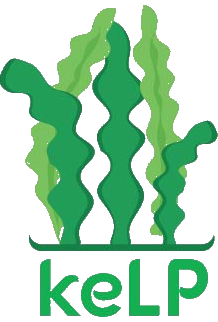

<!-- PROJECT SHIELDS -->
<!--
*** I'm using markdown "reference style" links for readability.
*** Reference links are enclosed in brackets [ ] instead of parentheses ( ).
*** See the bottom of this document for the declaration of the reference variables
*** for contributors-url, forks-url, etc. This is an optional, concise syntax you may use.
*** https://www.markdownguide.org/basic-syntax/#reference-style-links
-->
[![Contributors][contributors-shield]][contributors-url]
[![Forks][forks-shield]][forks-url]
[![Stargazers][stars-shield]][stars-url]
[![Issues][issues-shield]][issues-url]
[![MIT License][license-shield]][license-url]
[![LinkedIn][linkedin-shield]][linkedin-url]

<!-- PROJECT LOGO -->
 

  

  <h3 align="center">keLP - Keeping Everything Least Privileged</h3>

  

    keLP is a tool with the goal of automating the process of granting least privilege IAM roles for serverless applications in AWS.
     
    <a href="https://github.com/lamarrd/keLP"><strong>Explore the docs »</strong></a>
     
     
    <a href="https://github.com/lamarrd/keLP">View Demo</a>
    ·
    <a href="https://github.com/lamarrd/keLP/issues">Report Bug</a>
    ·
    <a href="https://github.com/lamarrd/keLP/issues">Request Feature</a>
  

<!-- GETTING STARTED -->
## Getting Started

To get a local copy up and running follow these simple steps.

### Installation

<!-- USAGE EXAMPLES -->
## Usage

Use this space to show useful examples of how a project can be used. Additional screenshots, code examples and demos work well in this space. You may also link to more resources.

_For more examples, please refer to the [Documentation](https://example.com)_

<!-- ROADMAP -->
## Roadmap

See the [open issues](https://github.com/lamarrd/keLP/issues) for a list of proposed features (and known issues).

<!-- CONTRIBUTING -->
## Contributing

Contributions are what make the open source community such an amazing place to be learn, inspire, and create. Any contributions you make are **greatly appreciated**.

1. Fork the Project
2. Create your Feature Branch (`git checkout -b feature/AmazingFeature`)
3. Commit your Changes (`git commit -m 'Add some AmazingFeature'`)
4. Push to the Branch (`git push origin feature/AmazingFeature`)
5. Open a Pull Request

<!-- LICENSE -->
## License

Distributed under the MIT License. See `LICENSE` for more information.

<!-- CONTACT -->
## Contact

Your Name - [@lamarr_henry](https://twitter.com/lamarr_henry) - henry.773@osu.edu

<!-- ACKNOWLEDGEMENTS -->
## Acknowledgements

* 
* 
* 

<!-- MARKDOWN LINKS & IMAGES -->
<!-- https://www.markdownguide.org/basic-syntax/#reference-style-links -->
[contributors-shield]: https://img.shields.io/github/contributors/lamarrd/keLP.svg?style=for-the-badge
[contributors-url]: https://github.com/lamarrd/keLP/graphs/contributors
[forks-shield]: https://img.shields.io/github/forks/lamarrd/keLP.svg?style=for-the-badge
[forks-url]: https://github.com/lamarrd/keLP/network/members
[stars-shield]: https://img.shields.io/github/stars/lamarrd/keLP.svg?style=for-the-badge
[stars-url]: https://github.com/lamarrd/keLP/stargazers
[issues-shield]: https://img.shields.io/github/issues/lamarrd/keLP.svg?style=for-the-badge
[issues-url]: https://github.com/lamarrd/keLP/issues
[license-shield]: https://img.shields.io/github/license/lamarrd/keLP.svg?style=for-the-badge
[license-url]: https://github.com/lamarrd/keLP/blob/master/LICENSE
[linkedin-shield]: https://img.shields.io/badge/-LinkedIn-black.svg?style=for-the-badge&logo=linkedin&colorB=555
[linkedin-url]: https://www.linkedin.com/in/lamarr-henry-a20218141/